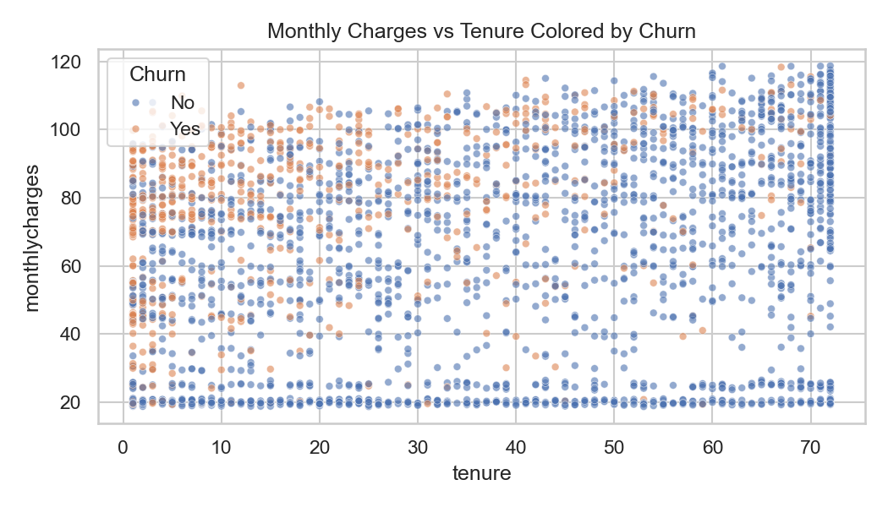
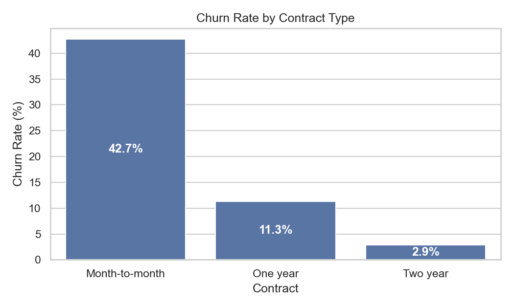
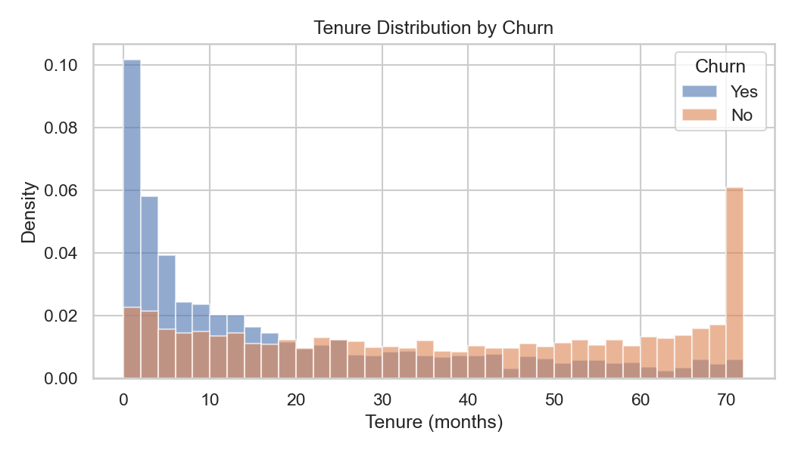
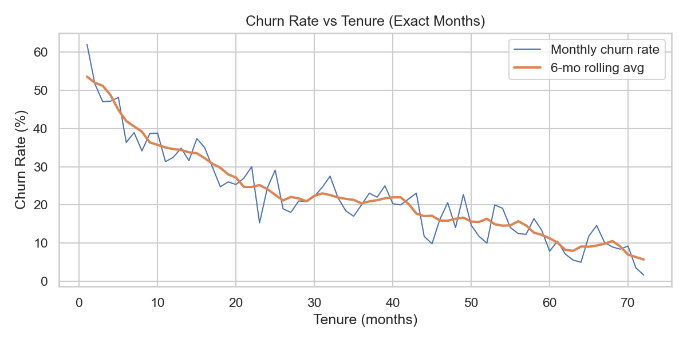
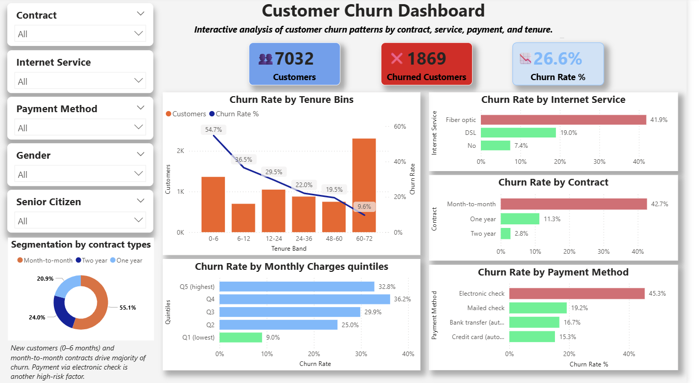

# 📊 Customer Churn Analysis Dashboard (Power BI + Python + SQL)

## 🎯 Objective: 
To analyze customer churn behavior, identify key factors influencing attrition, and deliver actionable insights to reduce churn and improve customer retention.

---
## 🧠 Overview

This project presents an end-to-end **Customer Churn Analysis** for a telecom company.<br>
Starting from **data cleaning** and **exploratory data analysis** in **Python**, moving through **SQL** segmentation, and culminating in an interactive **Power BI dashboard**, the goal was to uncover behavioral patterns behind customer churn and derive data-driven recommendations for retention strategies.

---

## 🧾 Dataset Information

**Source:** [`Telco Customer Churn Dataset (Kaggle)`](https://www.kaggle.com/datasets/blastchar/telco-customer-churn)

**File Used:** WA_Fn-UseC_-Telco-Customer-Churn.csv

### 📚 Data Dictionary

| Column | Description | Data Type |
|------|-----|---------|
| `customerID` | Unique identifier for each customer | String|
| `gender` | Customer gender (Male/Female) | String |
| `SeniorCitizen` | Indicates if the customer is a senior citizen (1/0) | Integer |
| `Partner` | Whether the customer has a partner | String |
| `Dependents` | Whether the customer has dependents |	String |
| `tenure` |	Number of months the customer has stayed |	Integer |
|  `Contract` |	Type of contract (Month-to-month, One year, Two year) |	String |
|  `InternetService` |	Internet type (DSL, Fiber optic, No) |	String |
|  `PaymentMethod` |	Billing method (Electronic check, Credit card, etc.) 	| String |
|  `MonthlyCharges` |	Amount charged to the customer monthly |	Float |
|  `TotalCharges`  |	Total amount charged  |	Float  |
|  `Churn` |	Whether the customer left the company |	String |

---

## ⚙️ Installation & Setup

You can run this project in two ways: **directly on Google Colab** or **locally on your system**.

---

### ▶️ Option 1: Run on Google Colab (Recommended)
No installation needed — just open the notebook and start running.

[](https://colab.research.google.com/github/Harsh1574/data-analytics-portfolio/blob/main/Customer-Churn-Analysis/Notebooks/01_data_overview.ipynb)
[](https://colab.research.google.com/github/Harsh1574/data-analytics-portfolio/blob/main/Customer-Churn-Analysis/Notebooks/02_data_eda.ipynb)

---

### 💻 Option 2: Run Locally
1. #### 📥 Clone this repository:
   ```bash
   git clone https://github.com/Harsh1574/data-analytics-portfolio.git
   cd data-analytics-portfolio/Customer_Churn_Analysis

_This project requires Python 3.9+ and packages listed in [`requirements.txt`](./requirements.txt). To install dependencies run the command in Step 2👇_

2. #### ⚙️ Install the required dependencies:
   ```bash
   pip install -r requirements.txt

3. #### 🚀 Launch Jupyter Notebook:
   ```bash
   jupyter notebook Notebooks/01_data_overview.ipynb
   jupyter notebook Notebooks/02_data_eda.ipynb
   


---

## 🧹 Data Preparation (Python)

- Performed data cleaning and transformation using Pandas:

- Handled missing and inconsistent values (TotalCharges nulls converted, data types fixed).

- Removed duplicates and whitespace inconsistencies.

- Standardized categorical columns (title case, unified naming).

- Created tenure_band and mc_quint (Monthly Charge Quintiles) for segmentation.

- Exported clean dataset → [`telco_dataset_cleaned.csv`](.Datasets/telco_dataset_cleaned.csv).

📁 File Location: `./Datasets/telco_dataset_cleaned.csv`

---

## 🧮 Exploratory Data Analysis (Python)

**Libraries Used:**
`pandas`, `numpy`, `matplotlib`, `seaborn`, `plotly`

- Performed detailed EDA to identify churn drivers:

- Churn distribution & overall rate

- Tenure vs Churn % trend

- Contract Type vs Churn Rate

- Monthly Charges & Payment Method influence

### 🖼️ Preview Charts:









_All the visualizations are available in the [`Screenshots`](./Screenshots/) folder._

---

## 🧩 SQL Analysis
A few SQL queries were written to validate churn trends and segment data before Power BI visualization:

sql
```
SELECT Contract, 
       ROUND(SUM(CASE WHEN Churn = 'Yes' THEN 1 ELSE 0 END) * 100.0 / COUNT(*), 2) AS ChurnRate
FROM telco_churn
GROUP BY Contract;
```
**📁 File Location:** [`./Notebooks/02_data_eda.ipynb`]

_To view the exploratory data analysis (EDA) file, [`click here`](./Notebooks/02_data_eda.ipynb)._

---

## 📌 Key Highlights

**💡 Overall Churn Rate: 26.6%**

**📉 Highest churn: Month-to-month customers (42.7%)**

**📈 Lowest churn: Two-year contracts (2.8%)**

**🔍 High-risk segments:**

  - **Fiber Optic** internet users (41.9% churn)

  - **Electronic Check** payments (45.3% churn)

**🧩 Custom DAX Tooltips:** Provide contract-wise, internet, and payment breakdown insights

**🎯 Interactive Slicers:** Contract, Internet Service, Payment Method, Gender, Senior Citizen

**🧮 DAX Measures:**

  - Churn Rate %

  - Churned Customers

  - Avg Monthly Charges

  - Custom insight measures for tooltip pages

---

## 📊 Power BI Dashboard

The Power BI dashboard provides a clear, interactive view of churn patterns with:

- KPI Cards (Customers, Churned, Churn Rate %)

- Churn by Tenure Bands

- Churn by Contract Type

- Churn by Internet Service

- Churn by Payment Method

- Churn by Monthly Charges Quintiles

---

## 🗂️ Power BI Dashboard Overview

| Page | Purpose |
|------|----------|
| 1️⃣ **Main Dashboard** | Main churn dashboard with KPIs and segment analysis |
| 2️⃣ **TT Contract** | Contract-wise deep-dive with tooltip insights |
| 3️⃣ **TT Payment** | Churn distribution by payment methods |
| 4️⃣ **TT Internet** | Churn analysis by internet service type |
| 5️⃣ **TT Tenure** | Tenure-based customer retention trend |
| 6️⃣ **TT Monthly** | Quintile-based monthly charge analysis |
| 7️⃣ **TT Contract Donut** | Distribution of internet and payment types within each contract |

---
## 📸 Dashboard Preview


_[**`Power BI Dashboard`**](./PBIX_File/Customer_Churn_Dashboard.pbix)↗️ - Explore the dashboard._

**📁 File Location:** `./PBIX_File/Customer_Churn_Dashboard.pbix`


---

## 🧩 DAX Logic Example

DAX
```
Churn Rate % = 
DIVIDE(
    [Churned Customers],
    [Customers],
    0
)
```

DAX
```
Contract Donut Insight =
VAR ContractType = SELECTEDVALUE(telco_dataset_cleaned[contract])
RETURN
SWITCH(
    TRUE(),
    ContractType = "Month-to-month",
        "Majority of short-term customers use Fiber Optic Internet and" & UNICHAR(10) &
        "Electronic Check payments, which strongly link to higher churn risk.",
    ContractType = "One year",
        "Balanced distribution across internet and payment types indicates moderate loyalty;" & UNICHAR(10) &
        "opportunities exist to convert to longer-term plans.",
    ContractType = "Two year",
        "Stable and diversified base with higher share of Credit Card and Bank Transfer users" & UNICHAR(10) &
        "representing the most loyal customer group.",
    "Select a contract type."
)
```

---
## 💡 Key Insights

|Segment	|Observation|	Recommendation|
|--|--|--|
|📊 Contract Type	|Month-to-month users have the highest churn (42.7%)|	Promote annual plans with bundled discounts|
|🌐 Internet Service	|Fiber optic customers show 41.9% churn|	Improve service quality and connection reliability|
|💳 Payment Method	|Electronic check users show 45% churn	|Encourage auto-pay via credit card or bank transfer|
|🕒 Tenure	|0–6 month customers churn 54.7%	|Improve onboarding and early engagement|
|💰 Monthly Charges	|Higher-paying customers have moderate churn	|Offer loyalty benefits and premium support|

---

## 🧰 Tools & Technologies

|Tool|Purpose|
|----|-------|
|**🐍 Python (Pandas, Seaborn, Matplotlib)**|Data cleaning and exploratory analysis|
|**🧮 SQL (MySQL / DuckDB)**|Querying and validation|
|🧠 **Power BI**|Dashboard visualization|
|🧮 **DAX**|Calculations and insights|
|🧹 **Excel/CSV**|Data preprocessing|
|📊 **Power Query**|Cleaning & transformation|
|**💻 GitHub**|Version control and portfolio hosting|

---
## 📁 Repository Structure
|Folder|	Description|
|--|--|
|`/Datasets/`|	Raw and cleaned datasets|
|`/SQL/`|	SQL queries for data segmentation|
|`/Notebooks/`|	Python notebooks for EDA|
|`/PBIX_File/`|	Power BI file (Customer_Churn.pbix)|
|`/Dashboard_Screenshots/`|	Power BI dashboard visuals|
|`/Screenshots/`|	EDA plots and data preview images|
|`/Docs/`|	Supporting documentation|
|`requirements.txt`|	Python dependencies|

---

## 🚀 Results & Impact

- ✅ Identified high-risk churn segments (Month-to-Month, Fiber Optic, Electronic Check users).
- ✅ Developed targeted retention strategies for each customer group.
- ✅ Created interactive tooltip-based Power BI dashboard to drill down into specific behaviors.
- ✅ Presented data storytelling insights for business decision-making.

---

## 📎 Quick Links

[`Telco Customer Churn Dataset – Kaggle (Download dataset)`↗️](https://www.kaggle.com/datasets/blastchar/telco-customer-churn)

[`Raw Dataset (CSV File)`↗️](./Datasets/telco_dataset_raw.csv)

[`Cleaned Dataset (CSV File)`↗️](./Datasets/telco_dataset_cleaned.csv)

[`Power BI Dashboard`↗️](./PBIX_File/Customer_Churn_Dashboard.pbix)

[`EDA Notebook`↗️](./Notebooks/02_data_eda.ipynb)

[`Data cleaning and exploration file`↗️](./Notebooks/01_data_overview.ipynb)

[`Python Dependencies File`↗️](./requirements.txt)

[`Dashboard Screenshots`↗️](./Dashboard_Screenshots/)

[`Python Visualizations Screenshots`↗️](./Screenshots/)

[`Business Insights & Recommendations`↗️](./Docs/insights.md)

[`Project Documentation`↗️](./PBIX_File/Customer_Churn_Dashboard.pbix)

---

## 👤 Connect with me

**Harshvardhan Rajgarhia**<br>
📧 Email - `harsvardhanrajgarhia@gmail.com`<br>
🔗 [`LinkedIn Profile`](https://www.linkedin.com/in/harshvardhan-rajgarhia-ba62982a4)<br>
📁 [`Portfolio Repository`](https://github.com/Harsh1574/data-analytics-portfolio)<br>

---

