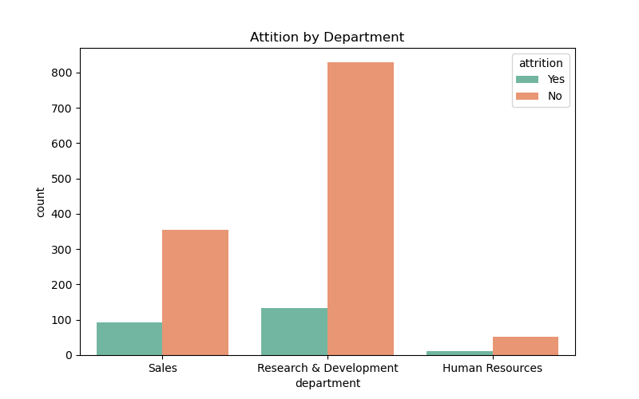
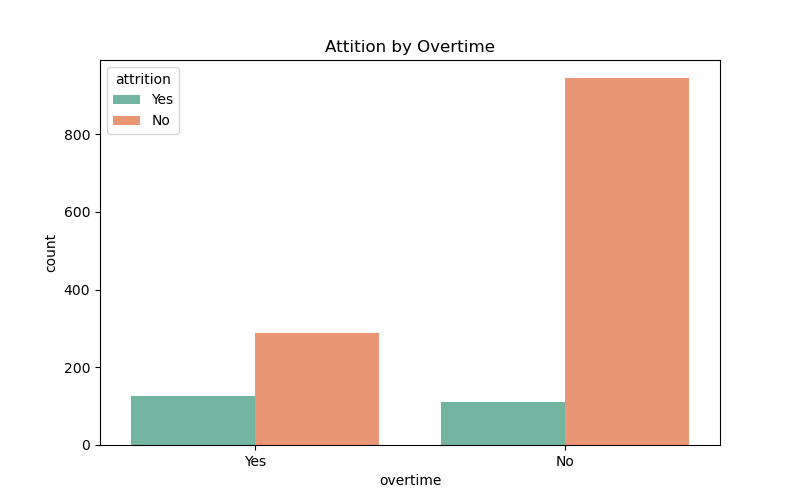
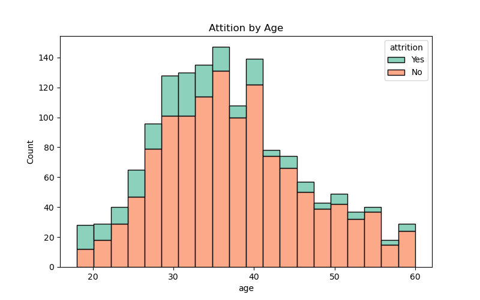
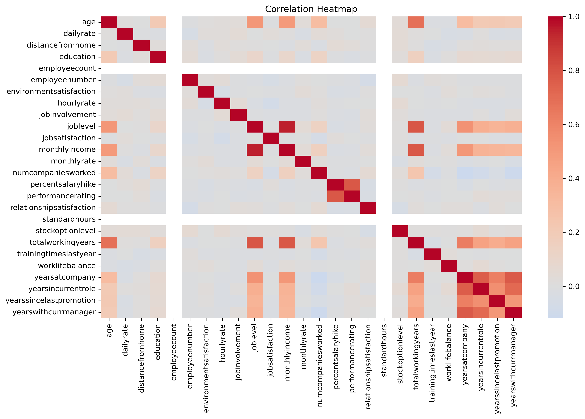

# 📊 Employee Attrition Analysis (Analytics Phase)

## 📌 Project Overview
This project analyzes employee attrition patterns using the **IBM HR Analytics dataset**.  
The goal is to identify key factors driving attrition and provide **actionable insights** for HR teams to improve retention.  

Attrition (employee turnover) refers to employees leaving the company.  
In this dataset:  
- **~16% of employees left (Attrition = Yes)**  
- **~84% of employees stayed (Attrition = No)**  

---

## ⚙️ Tools & Libraries
- **Python** → Pandas, Seaborn, Matplotlib  
- **Jupyter Notebook** → Interactive analysis  
- **Dataset** → IBM HR Attrition Dataset (Kaggle)  

---

## 📊 Business Insights

1. **Overall Attrition**
   - ~16% employees left the company.  
   - Attrition is a noticeable issue but not alarmingly high.

2. **Department-Wise**
   - **Sales** shows the highest attrition (~20%).  
   - HR moderate (~14%), R&D slightly lower (~13%).  

3. **Job Role-Wise**
   - **Sales Representatives** and **Lab Technicians** face the most turnover.  
   - **Managers** and **Directors** are the most stable roles.  

4. **Demographics**
   - **Younger employees (<35 years)** are more likely to leave.  
   - Gender differences are minimal.  
   - Married employees tend to be more stable.  

5. **Compensation**
   - Attrition is concentrated in **lower salary brackets**.  
   - Higher salaries strongly improve retention.  

6. **Workload**
   - Employees working **overtime** are ~3x more likely to leave.  
   - Work-life balance is a critical attrition factor.  

7. **Numeric Correlations**
   - **Monthly Income ↔ Job Level** (strong positive correlation).  
   - **Age ↔ Total Working Years** (expected relationship).  
   - No single numeric feature fully explains attrition — it is multi-factorial.  

---

## 📈 Key Visualizations
- Attrition Distribution (Yes/No)  
- Attrition by Department  
- Attrition by Job Role  
- Attrition by Gender  
- Attrition by Age  
- Attrition vs Monthly Income (Boxplot)  
- Attrition by Overtime  
- Correlation Heatmap (numeric features)  

---

## 📸 Highlighted Screenshots  

### Attrition by Department  
  
📊 **Insight:** Sales has the highest attrition (~20%).  
💡 **Recommendation:** Launch retention and incentive programs targeted at Sales roles.  

---

### Attrition by Overtime  
  
📊 **Insight:** Overtime employees are ~3x more likely to quit.  
💡 **Recommendation:** Improve workload balance and introduce overtime compensation.  

---

### Attrition by Age  
  
📊 **Insight:** Younger employees (25–35) show the highest turnover.  
💡 **Recommendation:** Focus on career development and mentorship for early-career employees.  

---

### Attrition by Monthly Income  
  
📊 **Insight:** Employees in lower income brackets leave more often.  
💡 **Recommendation:** Offer competitive pay bands and targeted salary revisions.  

---

### Correlation Heatmap  
  
📊 **Insight:** Job Level and Monthly Income are strongly correlated; Age and Work Experience align closely.  
💡 **Recommendation:** Use these features to design predictive models and tailor retention strategies.  

📂 *Additional visualizations are available in the [Screenshots folder](./Screenshots/).*  

---

## 📝 Business Recommendations (Summary)
- **Prioritize retention in Sales and entry-level roles**.  
- **Address compensation gaps** for lower income employees.  
- **Reduce overtime workload** and promote work-life balance.  
- **Engage younger employees (<35 years)** with mentorship and career paths.  

---

## ✅ Next Steps
This completes the **Analytics Phase** of the project.  
The next phase will extend this work into **Machine Learning models** to predict attrition and identify high-risk employees in advance.  

