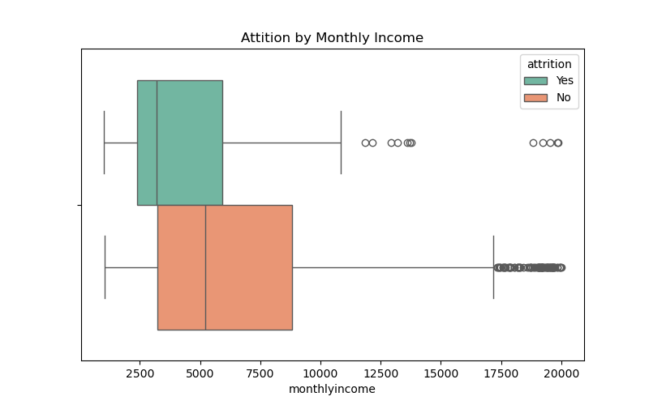
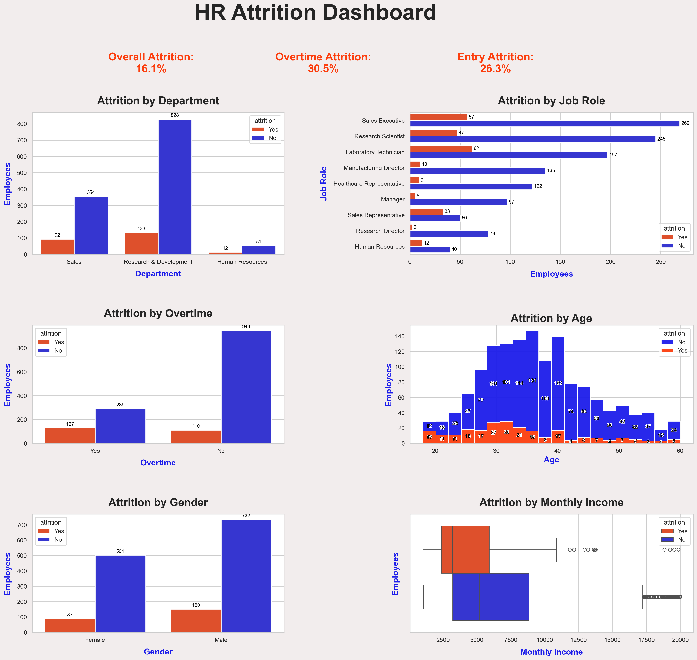

# 📊 Employee Attrition Analysis (Analytics Phase)

## 📌 Project Overview
This project analyzes employee attrition patterns using the **IBM HR Analytics dataset**.  
The goal is to identify key factors driving attrition and provide **actionable insights** for HR teams to improve retention.  

Attrition (employee turnover) refers to employees leaving the company.  
In this dataset:  
- **~16% of employees left (Attrition = Yes)**  
- **~84% of employees stayed (Attrition = No)**  

---

## ⚙️ Tools & Libraries
- **Python** → Pandas, Seaborn, Matplotlib  
- **Jupyter Notebook** → Interactive analysis  
- **Dataset** → IBM HR Attrition Dataset (Kaggle)  

---

## 📊 Dataset Description

The dataset used in this project is based on the **IBM HR Analytics Employee Attrition & Performance** dataset (publicly available on Kaggle).

**Rows:** ~1,470 employees

**Columns:** 35+ HR-related features

## 🔹 Key Features


**EmployeeID** → Unique identifier for each employee

**Attrition** → Target variable (Yes = Employee left, No = Employee stayed)

**Age** → Employee’s age

**Department** → HR, Sales, R&D

**JobRole** → Specific role (Sales Executive, Research Scientist, etc.)

**MonthlyIncome** → Monthly salary

**TotalWorkingYears** → Work experience

**OverTime** → Whether employee worked overtime (Yes/No)

**JobSatisfaction, WorkLifeBalance, EnvironmentSatisfaction** → Survey-based ratings

## 🔹 Notes

🧹 I performed data cleaning and transformations before analysis.

📒 The cleaned dataset is available here 👉 [`HR_Attrition_clean.csv`](./Datasets/HR_Attrition_clean.csv)
.

📒 Raw dataset ([`HR_Attrition_raw.csv`](./Datasets/HR_Attrition_raw.csv)) is also included for reference.

---
## ⚙️ Installation & Setup

You can run this project in two ways: **directly on Google Colab** or **locally on your system**.

---

### ▶️ Option 1: Run on Google Colab (Recommended)
No installation needed — just open the notebook and start running.

[](https://colab.research.google.com/github/Harsh1574/data-analytics-portfolio/blob/main/HR-Analysis/HR-Attrition-Project.ipynb)

---

### 💻 Option 2: Run Locally
1. #### 📥 Clone this repository:
   ```bash
   git clone https://github.com/Harsh1574/data-analytics-portfolio.git
   cd data-analytics-portfolio/HR-Analysis

_This project requires Python 3.9+ and packages listed in [`requirements.txt`](./requirements.txt). To install dependencies run the command in Step 2👇_

2. #### ⚙️ Install the required dependencies:
   ```bash
   pip install -r requirements.txt

3. #### 🚀 Launch Jupyter Notebook:
   ```bash
   jupyter notebook HR-Attrition-Project.ipynb


---


## 📊 Business Insights

### 1. Overall Attrition
   - ~16% employees left the company.  
   - Attrition is a noticeable issue but not alarmingly high.

### 2.  Department-Wise 
   - **Sales** shows the highest attrition (~20%).  
   - HR moderate (~14%), R&D slightly lower (~13%).  

### 3. Job Role-Wise
   - **Sales Representatives** and **Lab Technicians** face the most turnover.  
   - **Managers** and **Directors** are the most stable roles.  

### 4. Demographics
   - **Younger employees (<35 years)** are more likely to leave.  
   - Gender differences are minimal.  
   - Married employees tend to be more stable.  

### 5. Compensation
   - Attrition is concentrated in **lower salary brackets**.  
   - Higher salaries strongly improve retention.  

### 6. Workload
   - Employees working **overtime** are ~3x more likely to leave.  
   - Work-life balance is a critical attrition factor.  

### 7. Numeric Correlations
   - **Monthly Income ↔ Job Level** (strong positive correlation).  
   - **Age ↔ Total Working Years** (expected relationship).  
   - No single numeric feature fully explains attrition — it is multi-factorial.  

---

## 📈 Key Visualizations
- Attrition Distribution (Yes/No)  
- Attrition by Department  
- Attrition by Job Role  
- Attrition by Gender  
- Attrition by Age  
- Attrition vs Monthly Income (Boxplot)  
- Attrition by Overtime  
- Correlation Heatmap (numeric features)  

---

## 📂 Project Files  

- 📓 [`Jupyter Notebook`](./HR-Attrition-Project.ipynb) → Full code for data cleaning, EDA, and visualizations  
- 📑 [`Documentation Report (PDF)`](./HR-Attrition-Documentation.pdf) → Business insights and recommendations
- 📒 [`Cleaned Dataset`](./Datasets/HR_Attrition_clean.csv) → Final dataset prepared after cleaning and feature engineering 
- 📒 [`Requirements`](./requirements.txt) → Final dataset prepared after cleaning and feature engineering 

---

## 📸 Highlighted Screenshots  

### Attrition by Department  
  
📊 **Insight:** Sales has the highest attrition (~20%).  
💡 **Recommendation:** Launch retention and incentive programs targeted at Sales roles.  

---

### Attrition by Overtime  
  
📊 **Insight:** Overtime employees are ~3x more likely to quit.  
💡 **Recommendation:** Improve workload balance and introduce overtime compensation.  

---

### Attrition by Age  
  
📊 **Insight:** Younger employees (25–35) show the highest turnover.  
💡 **Recommendation:** Focus on career development and mentorship for early-career employees.  

---

### Attrition by Monthly Income  
  
📊 **Insight:** Employees in lower income brackets leave more often.  
💡 **Recommendation:** Offer competitive pay bands and targeted salary revisions.  

---

### Correlation Heatmap  
  
📊 **Insight:** Job Level and Monthly Income are strongly correlated; Age and Work Experience align closely.  
💡 **Recommendation:** Use these features to design predictive models and tailor retention strategies.  

---
## 📈 Summary Dashboard

  

👉 **Department:** Sales has the highest attrition (20%).

👉 **Overtime:** ~69% of leavers work overtime.

👉 **Income:** leavers are clustered at lower pay bands.

👉 **Job Roles:** Sales Rep & Lab Tech highest churn.

👉 **Age:** early-career churn (25–35).

📂 *Additional visualizations are available in the [`Screenshots folder`](./Screenshots/).*  

---

## 📝 Business Recommendations (Summary)
- **Prioritize retention in Sales and entry-level roles**.  
- **Address compensation gaps** for lower income employees.  
- **Reduce overtime workload** and promote work-life balance.  
- **Engage younger employees (<35 years)** with mentorship and career paths.  

---

## ✅ Next Steps
This completes the **Analytics Phase** of the project.  
The next phase will extend this work into **Machine Learning models** to predict attrition and identify high-risk employees in advance.  


