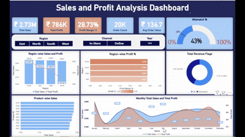

# 📊 Sales & Profit Analysis Dashboard

### 🔹 Overview
An interactive Power BI dashboard analyzing **20,000+ sales transactions** across 4 regions, 10 products, and 12 months.  
It provides executives and managers with actionable insights on revenue, profit, profit margin, and order trends.

---

### 🔹 Tools & Techniques
- **Power BI** → Dashboard design & interactivity  
- **Power Query** → Data cleaning & transformations  
- **DAX** → KPI calculations (Total Sales, Profit Margin, Avg Order Value)  
- **Excel (CSV)** → Data source  

---

### 🔹 Key Features
- KPI Cards: Total Sales, Total Profit, Profit Margin %, Order Count, Avg Order Value  
- Filters (Slicers): Year, Region, Channel  
- Visuals:  
  - Line Chart → Monthly Sales & Profit  
  - Clustered Column → Region-wise Sales & Profit  
  - Donut Chart → Revenue Flags (Data Quality)  
  - Gauge → Data Mismatch %  
  - Drill-through → Store/Product details  

---

### 🔹 Business Insights
- **Revenue**: South region highest (~₹700K).  
- **Profitability**: Avg. profit margin ~29%.  
- **Top Product**: Product P010 consistently ranked #1.  
- **Data Quality**: ~43% mismatch in revenue records.  
- **Trend**: Sales peaked in Q4.  

---

### 🔹 Files Included
- [`Sales Analysis Dashboard Project.pbix`](./Sales-Analysis-Dashboard-Project.pbix) → Power BI file
- [`Sales Dashboard Project Documentation.pdf`](./Sales-Dashboard-Project-Documentation.pdf) → Full project report
- [`Screenshots`](./Screenshots/) → Key visuals from dashboard  

---

### 📊 Datasets
- [Cleaned Dataset (CSV)](./Sales-Datasets/Cleaned-Datasets/) → Final dataset used for analysis
- [Raw Dataset (CSV)](./Sales-Datasets/Original-Datasets/) → Original dataset before cleaning

Data cleaning steps applied: 
- Removed duplicates 
- Handled nulls
- Standardized columns
- Created calculated fields for Sales, Profit, and Margin
  

---

### **📸 Dashboard-Demo**

  

### 📸 **Screenshots**

  1️⃣ **Main Dashboard**

  2️⃣ **Drill Through Dashboard**

---

🔗 **Live Portfolio Link** → [Back to Main Portfolio](../README.md)
